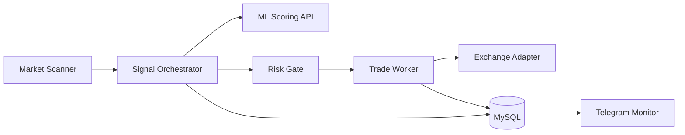

# AI Crypto Trading Platform

Public engineering case study for an AI-assisted crypto futures trading platform. The production system combines a TypeScript trading engine, Python ML service, MySQL persistence, Telegram monitoring, and exchange integrations.

This repository is not a trading strategy dump. It is a sanitized showcase of system architecture, risk boundaries, scoring composition, tests, CI, and production thinking.

## Problem

Automated trading systems fail when decision-making, risk management, and position lifecycle logic are coupled into a single loop. Slow provider responses, stale market data, model latency, or exchange errors can block safety-critical work.

The product problem is not just "find signals". The real challenge is building a system that can:

- scan markets continuously;
- evaluate candidates with deterministic risk gates;
- separate entry logic from exit management;
- observe model behavior over time;
- recover safely from process restarts and provider failures.

## Solution

The system is split into independent responsibilities:

- scanner discovers candidate symbols;
- orchestrator builds a market snapshot and evaluates entry intent;
- ML service scores context and features;
- risk gate rejects unsafe trades before exchange interaction;
- worker owns open position lifecycle and safety exits;
- persistence stores decisions, outcomes, and feedback.

## Key Features

- Multi-stage market scanner.
- ML-assisted signal scoring.
- Explicit risk gate before trade intent.
- Worker-based position lifecycle management.
- Telegram monitoring and operational alerts.
- MySQL-backed audit trail.
- CI-tested signal scoring example.

## Architecture



The most important design principle is separation of responsibility. Scanning, decision-making, and position management should be independently observable and restartable.

## Tech Stack

- TypeScript, Node.js, exchange SDK patterns.
- Python, FastAPI, pandas, scikit-learn, XGBoost in the production ML service.
- MySQL for persistence.
- Telegram Bot API for monitoring.
- Vitest and GitHub Actions for tests/CI.

## Engineering Highlights

- `docs/adr/0001-separate-scanner-orchestrator-worker.md` documents the runtime split.
- `examples/signal-engine/signalScore.ts` shows a sanitized scoring composition.
- `tests/signalScore.test.ts` covers high-quality signals, wide spreads, and low-liquidity candidates.
- `docs/production.md` covers kill switches, idempotent order intents, observability, and rollout safety.
- `docs/roadmap.md` outlines replay mode, adapter contract tests, queueing, and model drift tracking.

## Production Considerations

Trading systems need strong operational controls:

- hard kill switch for new entries;
- persisted trade intents;
- explicit provider timeouts;
- idempotent order placement;
- monitoring for drawdown, exchange latency, and model confidence drift;
- testnet-first release process for strategy changes.

## Public vs Private

Included in this repository:

- architecture docs;
- sanitized signal scoring example;
- tests and CI;
- ADR, production notes, roadmap.

Excluded from this repository:

- exchange keys;
- proprietary trading strategies;
- model weights;
- risk parameters;
- production database schemas;
- deployment configuration.

## Local Development

```bash
npm install
npm run typecheck
npm test
```

## Disclaimer

This repository is an engineering showcase, not financial advice or a trading recommendation.
