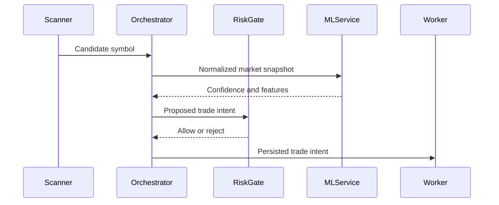

# Architecture

The production system is split into independent runtime responsibilities:

```text
Market Scanner -> Signal Orchestrator -> Risk Gate -> Exchange Adapter
       |                  |                |
       v                  v                v
    MySQL           ML Scoring API     Trade Worker
       |
       v
 Telegram Monitor
```

## Design Notes

- The scanner only discovers candidates. It does not place trades.
- The orchestrator builds a normalized market snapshot and asks downstream evaluators for a decision.
- Risk gates are explicit and run before any exchange-side operation.
- Trade lifecycle management is handled by a separate worker so exits and safety controls continue independently.
- ML feedback is stored as events, not as hidden mutable state.

## Public-Safe Simplification

The real strategy, feature weights, model training pipeline, exchange adapters, and risk parameters are not included. The example code demonstrates structure, validation, and scoring composition only.

## Sequence: Signal Evaluation


